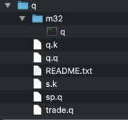
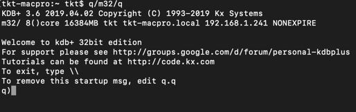

link download: [https://kx.com/download/](https://kx.com/download/)

# Window
```ini
c:/q          / Main q directory
c:/q/w32/     / Location of windows 32-bit executable
```
# linux
```ini
~/q       / main q directory (under the user home)
~/q/l32   / location of linux 32-bit executable
```
#Mac
```ini
~/q       / main q directory (under the user home)
~/q/m32   / Location of mac 32-bit executable
```



# Starting the q Environment

open terminal and run `~/q/m32/q` on mac

